Compare correlations
================
Guillaume A. Rousselet
2019-05-27

Dependencies
============

``` r
library(tibble)
library(ggplot2)
library(beepr)
# library(cowplot)
source("./functions/theme_gar.txt")
source("./functions/Rallfun-v35.txt")
```

``` r
sessionInfo()
```

    ## R version 3.5.2 (2018-12-20)
    ## Platform: x86_64-apple-darwin15.6.0 (64-bit)
    ## Running under: macOS Mojave 10.14.4
    ## 
    ## Matrix products: default
    ## BLAS: /Library/Frameworks/R.framework/Versions/3.5/Resources/lib/libRblas.0.dylib
    ## LAPACK: /Library/Frameworks/R.framework/Versions/3.5/Resources/lib/libRlapack.dylib
    ## 
    ## locale:
    ## [1] en_GB.UTF-8/en_GB.UTF-8/en_GB.UTF-8/C/en_GB.UTF-8/en_GB.UTF-8
    ## 
    ## attached base packages:
    ## [1] stats     graphics  grDevices utils     datasets  methods   base     
    ## 
    ## other attached packages:
    ## [1] beepr_1.3     ggplot2_3.1.1 tibble_2.1.1 
    ## 
    ## loaded via a namespace (and not attached):
    ##  [1] Rcpp_1.0.1       knitr_1.21       magrittr_1.5     tidyselect_0.2.5
    ##  [5] munsell_0.5.0    colorspace_1.4-1 R6_2.4.0         rlang_0.3.4     
    ##  [9] stringr_1.4.0    plyr_1.8.4       dplyr_0.8.0.1    tools_3.5.2     
    ## [13] grid_3.5.2       gtable_0.3.0     xfun_0.4         audio_0.1-5.1   
    ## [17] withr_2.1.2      htmltools_0.3.6  yaml_2.2.0       lazyeval_0.2.2  
    ## [21] digest_0.6.18    assertthat_0.2.1 crayon_1.3.4     purrr_0.3.2     
    ## [25] glue_1.3.1       evaluate_0.13    rmarkdown_1.11   stringi_1.4.3   
    ## [29] compiler_3.5.2   pillar_1.3.1     scales_1.0.0     pkgconfig_2.0.2

Correlation functions
=====================

From the stats package
----------------------

Pearson: `cor.test(x, y, method = “pearson")` Spearman: `cor.test(x, y, method = "spearman")` Kendall: `cor.test(x, y, method = "kendall")`

From Rand Wilcox
----------------

winsorised correlation: `wincor()`, `winall()` percentage bend correlation: `pbcor()`, `pball()` skipped correlations: `scor()`, `scorci()`, `mscor()`

Generate data
=============

In this example we sample from 2 uncorrelated variables. By chance there seems to be a non negligeable correlation. Changing the random seed or commenting out the line `set.seed(21)` will give different results. You can also sample trials from variables with a true correlation by changing `rho`.

``` r
set.seed(21)
n <- 50 # sample size
mu <- c(0, 0) # means of the variables
rho <- 0 # correlation between variables
sigma <- matrix(c(1, rho, rho, 1), nrow = 2, byrow = TRUE) # covariance matrix
data <- MASS::mvrnorm(n = n, mu = mu, Sigma = sigma)
x <- data[,1]
y <- data[,2]

# make data frame
df <- tibble(x = x,
             y = y)

# ggplot figure
ggplot(df, aes(x = x, y = y)) + theme_classic() +
  # geom_hline(yintercept = 0) +
  # geom_vline(xintercept = 0) +
  geom_point(alpha = 0.4, size = 3) +
  # add smooth regression trend?
  # geom_smooth(method='loess',formula=y~x) +
  theme(axis.title = element_text(size = 15, colour = "black"),
        axis.text = element_text(size = 13, colour = "black"),
        strip.text = element_text(size = 15, face = "bold")) +
  # scale_x_continuous(limits = c(-4, 4),
  #                    breaks = seq(-4, 4, 1)) +
  labs(x = expression(italic("Variable A")), y = expression(italic("Variable B")))
```

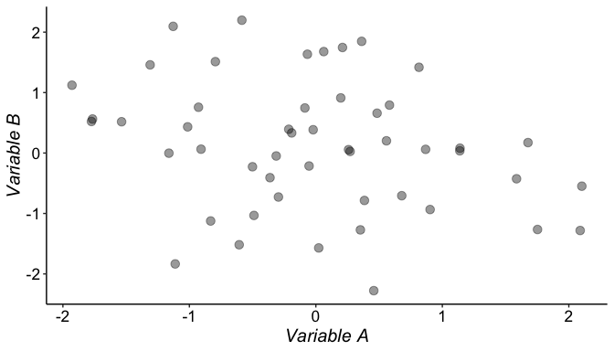

``` r
# ggsave(filename = "./corr_samp.pdf")
```

Pearson's correlation
=====================

``` r
out <- cor.test(x,y, method = "pearson")
out
```

    ## 
    ##  Pearson's product-moment correlation
    ## 
    ## data:  x and y
    ## t = -1.9622, df = 48, p-value = 0.05555
    ## alternative hypothesis: true correlation is not equal to 0
    ## 95 percent confidence interval:
    ##  -0.512010705  0.006329091
    ## sample estimates:
    ##        cor 
    ## -0.2724987

Percentile bootstrap confidence interval
========================================

Pearson correlation
-------------------

``` r
pcorb(x,y, SEED = FALSE)
```

    ## $r
    ## [1] -0.2724987
    ## 
    ## $ci
    ## [1] -0.5155597 -0.0107188

### Pearson correlation: detailed code

Depending on the sample size, the CI bounds are adjusted. Without the adjustement, the coverage is incorrect when there is heteroscedasticity.

``` r
set.seed(21)
nboot <- 599
# sample pairs of observations with replacement
data <- matrix(sample(length(y),size=length(y)*nboot,replace=TRUE),nrow=nboot)
# compute correlation for each pair
bvec <- apply(data,1,pcorbsub,x,y) # A 1 by nboot matrix.
# confidence interval is computed using special adjustments to account for heteroscedasticity
ilow<-15
ihi<-584
if(length(y) < 250){
ilow<-14
ihi<-585
}
if(length(y) < 180){
ilow<-11
ihi<-588
}
if(length(y) < 80){
ilow<-8
ihi<-592
}
if(length(y) < 40){
ilow<-7
ihi<-593
}
bsort <- sort(bvec)
ci <-c (bsort[ilow],bsort[ihi])

ggplot(enframe(bvec, name = NULL), aes(x = value)) + theme_bw() +
  geom_histogram(aes(y = ..density..), bins = 50,
                 fill = "white", colour = "black") +
  theme(axis.text = element_text(size = 14),
        axis.title = element_text(size = 16)) +
  labs(x = "Bootstrap correlations") 
```

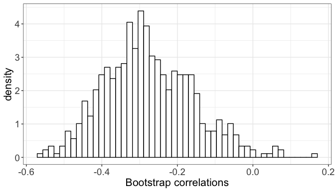

``` r
# ggsave(filename = "./pboot_dist.pdf")
```

percentage bend correlation
---------------------------

``` r
corb(x,y, corfun = pbcor, SEED = FALSE)
```

    ## $cor.ci
    ## [1] -0.49637489  0.02030406
    ## 
    ## $p.value
    ## [1] 0.06677796
    ## 
    ## $cor.est
    ## [1] -0.2502435

25% Winsorized correlation
--------------------------

``` r
corb(x,y, corfun=wincor, tr=0.25, SEED = FALSE)
```

    ## $cor.ci
    ## [1] -0.51192940  0.07599039
    ## 
    ## $p.value
    ## [1] 0.1268781
    ## 
    ## $cor.est
    ## [1] -0.2251957

skipped correlation: Pearson
----------------------------

``` r
mscor(cbind(x,y),corfun=pcor)
```

    ## 
    ## Attaching package: 'MASS'

    ## The following object is masked _by_ '.GlobalEnv':
    ## 
    ##     ltsreg

    ## $cor
    ##            [,1]       [,2]
    ## [1,]  1.0000000 -0.2724987
    ## [2,] -0.2724987  1.0000000
    ## 
    ## $crit.val
    ## [1] 2.48066
    ## 
    ## $test.stat
    ##          [,1]     [,2]
    ## [1,]       NA 1.962183
    ## [2,] 1.962183       NA

skipped correlation: Spearman
-----------------------------

``` r
mscor(cbind(x,y),corfun=spear)
```

    ## $cor
    ##            x          y
    ## x  1.0000000 -0.2632893
    ## y -0.2632893  1.0000000
    ## 
    ## $crit.val
    ## [1] 2.48066
    ## 
    ## $test.stat
    ##          x        y
    ## x       NA 1.890836
    ## y 1.890836       NA

Compare correlations
====================

Independent case
----------------

In this situation, we have 2 groups, for each group we measure variables A and B and then estimate their correlations.

### Generate data

``` r
set.seed(21)
n <- 50 # sample size
mu <- c(0, 0) # means of the variables
rho <- 0.5 # correlation between variables
sigma1 <- matrix(c(1, rho, rho, 1), nrow = 2, byrow = TRUE) # covariance matrix
rho <- 0.6 # correlation between variables
sigma2 <- matrix(c(1, rho, rho, 1), nrow = 2, byrow = TRUE) # covariance matrix

# group 1
data <- MASS::mvrnorm(n = n, mu = mu, Sigma = sigma1)
x1 <- data[,1]
y1 <- data[,2]

# group 2
data <- MASS::mvrnorm(n = n, mu = mu, Sigma = sigma2)
x2 <- data[,1]
y2 <- data[,2]

# make data frame
df <- tibble(x = c(x1, x2),
             y = c(y1, y2),
             group = factor(c(rep("group1",n),rep("group2",n))))

# ggplot figure
p <- ggplot(df, aes(x = x, y = y)) + theme_gar +
  # geom_hline(yintercept = 0) +
  # geom_vline(xintercept = 0) +
  geom_point(alpha = 0.4, size = 3) +
  # add smooth regression trend?
  # geom_smooth(method='loess',formula=y~x) +
  labs(x = expression(italic("Variable A")), y = expression(italic("Variable B"))) +
  facet_grid(cols = vars(group))
pA1 <- p
p
```

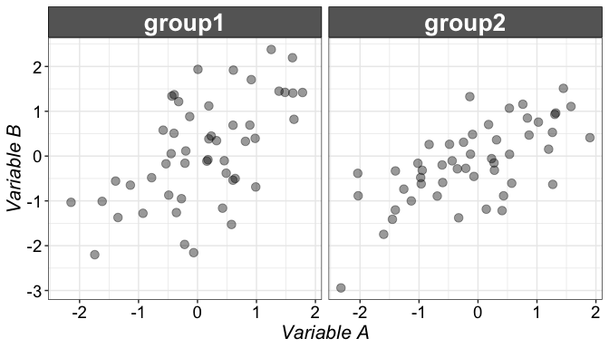

### Two Pearson correlations

``` r
twopcor(x1,y1,x2,y2, SEED = FALSE)
```

    ## [1] "Taking bootstrap samples; please wait"

    ## $r1
    ## [1] 0.574752
    ## 
    ## $r2
    ## [1] 0.6672727
    ## 
    ## $ci
    ## [1] -0.3285954  0.1626231

### Two robust correlations

Percentage bend correlation

``` r
twocor(x1,y1,x2,y2, corfun = pbcor)
```

    ## $r1
    ## [1] 0.5669456
    ## 
    ## $r2
    ## [1] 0.6443677
    ## 
    ## $ci.dif
    ## [1] -0.4267458  0.1629391
    ## 
    ## $p.value
    ## [1] 0.5542571

Spearman correlation

``` r
twocor(x1,y1,x2,y2, corfun = spear)
```

    ## $r1
    ## [1] 0.5484274
    ## 
    ## $r2
    ## [1] 0.6445618
    ## 
    ## $ci.dif
    ## [1] -0.4241550  0.1784669
    ## 
    ## $p.value
    ## [1] 0.4974958

``` r
out <- twocor(x1,y1,x2,y2, corfun = spear)
cor1 <- out$r1
cor2 <- out$r2
```

Blank panel of text results

Define function

``` r
plot_textres <- function(x1,y1,x2,y2,size=10){
  
  res1 <- spear(x1,y1)$cor
  res2 <- spear(x2,y2)$cor
  diff <- round(res1-res2, digits = 3)
  res1 <- round(res1, digits = 2)
  res2 <- round(res2, digits = 2)
  df <- tibble(x = seq(1,2,length.out = 4), y = seq(0,4,length.out = 4))
  
  p <- ggplot(data = df, mapping=aes(x=x, y=y)) + theme_gar +
    geom_blank() +
    theme(axis.title = element_blank(),
      axis.ticks = element_blank(),
      axis.text = element_blank(),
      panel.grid.major = element_blank(), 
      panel.grid.minor = element_blank()) +
    geom_label(x = 1.5, y = 3, size = size, fontface= "bold",
      label = paste0("r1 = ", res1)) +
    geom_label(x = 1.5, y = 2, size = size, fontface= "bold",
      label = paste0("r2 = ", res2)) +
    geom_label(x = 1.5, y = 1, size = size, fontface= "bold",
      label = paste0("r1 - r2 = ", diff))
  p
}
```

Make figure

``` r
p <- plot_textres(x1,y1,x2,y2)
pA2 <- p
p
```

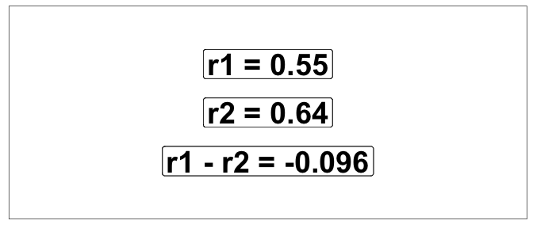

### Bootstrap samples

We take bootstrap samples, illustrate them and compute Spearman's correlation.

``` r
set.seed(21)
# Sample pairs of observations with replacement
bootid1.1 <- sample(length(y1),size=length(y1),replace=TRUE)
bootid1.2 <- sample(length(y2),size=length(y2),replace=TRUE)

bootid2.1 <- sample(length(y1),size=length(y1),replace=TRUE)
bootid2.2 <- sample(length(y2),size=length(y2),replace=TRUE)

bootid3.1 <- sample(length(y1),size=length(y1),replace=TRUE)
bootid3.2 <- sample(length(y2),size=length(y2),replace=TRUE)

# make data frame
df <- tibble(x = c(x1[bootid1.1], x2[bootid1.2], 
                   x1[bootid2.1], x2[bootid2.2], 
                   x1[bootid3.1], x2[bootid3.2]),
             y = c(y1[bootid1.1], y2[bootid1.2],
                   y1[bootid2.1], y2[bootid2.2],
                   y1[bootid3.1], y2[bootid3.2]),
             group = factor(rep(c(rep("group1",n),rep("group2",n)),3)),
             boot = factor(rep(c("boot1","boot2","boot3"),each = n*2)))

# ggplot figure
p <- ggplot(df, aes(x = x, y = y)) + theme_gar +
  geom_point(alpha = 0.4, size = 3) +
  # add smooth regression trend?
  # geom_smooth(method='loess',formula=y~x) +
  scale_y_continuous(breaks = seq(-4, 4, 2)) +
  labs(x = expression(italic("Variable A")), y = expression(italic("Variable B"))) +
  facet_grid(rows = vars(boot), cols = vars(group))
pB1 <- p
p
```

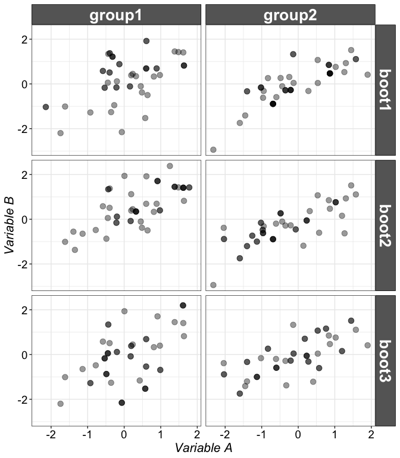

Text of results

``` r
pB2.1 <- plot_textres(x1[bootid1.1], y1[bootid1.1],
                      x2[bootid1.2], y2[bootid1.2], size = 6)
pB2.2 <- plot_textres(x1[bootid2.1], y1[bootid2.1],
                      x2[bootid2.2], y2[bootid2.2], size = 6)
pB2.3 <- plot_textres(x1[bootid3.1], y1[bootid3.1],
                      x2[bootid3.2], y2[bootid3.2], size = 6)

pB2 <- cowplot::plot_grid(pB2.1, pB2.2, pB2.3,
                    labels = NA,
                    ncol = 1,
                    nrow = 3,
                    rel_heights = c(1, 1, 1), 
                    label_size = 20, 
                    hjust = -0.5, 
                    scale=.95,
                    align = "h")
pB2
```

    ## Warning: Removed 1 rows containing missing values (geom_text).

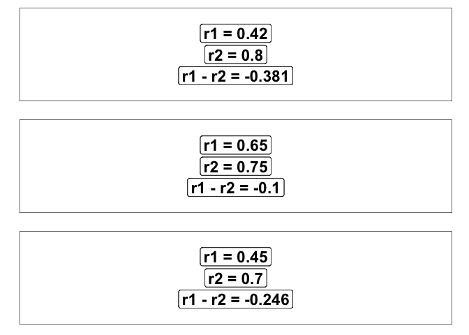

All bootstrap samples

``` r
set.seed(21)
nboot <- 5000 # number of bootstrap samples
alpha <- 0.05 # alpha level for confidence interval
corfun <- spear # robust correlation method to use
data1 <- matrix(sample(length(y1),size=length(y1)*nboot,replace=TRUE),nrow=nboot)
bvec1 <- apply(data1,1,corbsub,x1,y1,corfun) # A 1 by nboot matrix.
data2 <- matrix(sample(length(y2),size=length(y2)*nboot,replace=TRUE),nrow=nboot)
bvec2 <- apply(data2,1,corbsub,x2,y2,corfun) # A 1 by nboot matrix.
bvec <- sort(bvec1-bvec2)
corci1 <- quantile(bvec1, probs = c(alpha/2, 1-alpha/2), type = 6)
corci2 <- quantile(bvec2, probs = c(alpha/2, 1-alpha/2), type = 6)
corci.diff <- quantile(bvec, probs = c(alpha/2, 1-alpha/2), type = 6)
```

Illustrate groups 1 and 2

``` r
df <- tibble(x = c(bvec1, bvec2),
             group = factor(c(rep("group1",nboot),rep("group2",nboot))))

df.cor <- tibble(cor = c(cor1, cor2),
                 group = factor(c("group1", "group2")))

df.ci <- tibble(x = c(corci1[1], corci2[1]),
                xend = c(corci1[2], corci2[2]),
                y = c(0, 0),
                yend = c(0, 0),
                group = factor(c("group1", "group2")))
  
p <- ggplot(df, aes(x = x)) + theme_gar +
  # density
  geom_line(stat = "density", size = 1) +
  # sample correlation: vertical line + label
  geom_vline(data = df.cor, aes(xintercept = cor)) +
  # geom_label(data = df.cor, aes(labe), x = 2.3, y = 1.2, size = 7,
  #            colour = "white", fill = "black", fontface = "bold",
  #            label = paste("Sample mean = ", round(cor, digits = 2))) +
  # confidence interval ----------------------
  geom_segment(data = df.ci,
               aes(x = x, xend = xend, y = y, yend = yend),
               lineend = "round", size = 2, colour = "black") +
  labs(x = "Bootstrap correlations",
       y = "Density") +
  facet_grid(cols = vars(group))
  
  # geom_label(x = bootci[1]+0.15, y = 0.07, size = 5,
  #            colour = "white", fill = "black", fontface = "bold",
  #            label = paste("L = ", round(bootci[1], digits = 2))) +
  # geom_label(x = bootci[2]-0.15, y = 0.07, size = 5,
  #            colour = "white", fill = "black", fontface = "bold",
  #            label = paste("U = ", round(bootci[2], digits = 2))) +
  
p
```

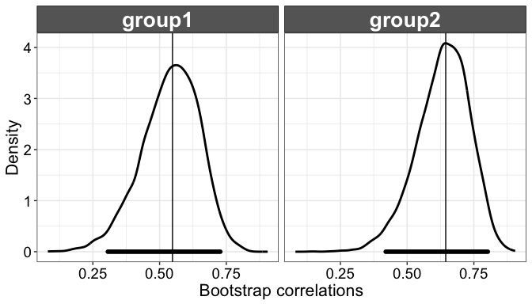

``` r
pC1 <- p
```

Illustrate difference

``` r
df <- tibble(x = bvec)

p <- ggplot(df, aes(x = x)) + theme_gar +
      geom_line(stat = "density", size = 1) +
  labs(x = "Bootstrap differences",
       y = "Density") +
  # confidence interval ----------------------
  geom_segment(x = corci.diff[1], xend = corci.diff[2],
               y = 0, yend = 0,
               lineend = "round", size = 2, colour = "black") +
  # geom_label(x = corci.diff[1]+0, y = 0.1, size = 5,
  #            colour = "white", fill = "black", fontface = "bold",
  #            label = paste("L = ", round(corci.diff[1], digits = 2))) +
  # geom_label(x = corci.diff[2]-0, y = 0.1, size = 5,
  #            colour = "white", fill = "black", fontface = "bold",
  #            label = paste("U = ", round(corci.diff[2], digits = 2))) +
  # sample mean: vertical line + label
  geom_vline(xintercept = cor1-cor2,
             linetype = 'solid') +
  # geom_label(x = 2.3, y = 1.2, size = 7,
  #            colour = "white", fill = "black", fontface = "bold",
  #            label = paste("Sample difference = ", round(cor1-cor2, digits = 2)))
  ggtitle(paste0(round(cor1-cor2,digits = 3),
                 " [",
                 round(corci.diff[1],digits = 3),
                 ", ",
                 round(corci.diff[2],digits = 3)
                 ,"]"))
p
```

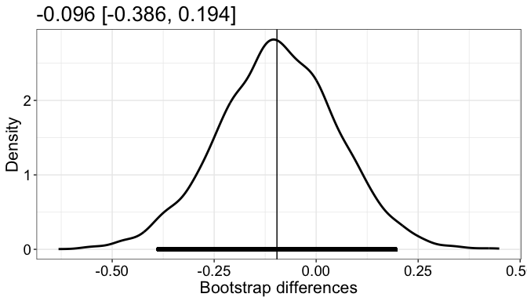

``` r
pC2 <- p
```

### Make summary figure

``` r
pA <- cowplot::plot_grid(pA1, pA2,
                    labels = NA,
                    ncol = 2,
                    nrow = 1,
                    rel_widths = c(2, 1), 
                    label_size = 20, 
                    hjust = -0.5, 
                    scale=.95)

pB <- cowplot::plot_grid(pB1, pB2,
                    labels = NA,
                    ncol = 2,
                    nrow = 1,
                    rel_widths = c(2, 1), 
                    label_size = 20, 
                    hjust = -0.5, 
                    scale=.95)

pC <- cowplot::plot_grid(pC1, pC2,
                    labels = NA,
                    ncol = 2,
                    nrow = 1,
                    rel_widths = c(2, 1), 
                    label_size = 20, 
                    hjust = -0.5, 
                    scale=.95)

cowplot::plot_grid(pA, pB, pC,
                    labels = c("A", "B", "C"),
                    ncol = 1,
                    nrow = 3,
                    rel_heights = c(1, 1.5, 1), 
                    label_size = 20, 
                    hjust = -0.5, 
                    scale=.95)

# save figure
ggsave(filename=('./figures/figure_compcorr.pdf'),width=12,height=14)
```

### Simulation: vary n

What sample size do we need to detect a correlation difference between a sample from a population with rho = 0.5 and a sample from a population with rho = 0.6? What sample size do we need to achieve a certain level of precision in the estimation of the difference between correlation coefficients?

``` r
# Modify spear() to return only correlation coefficient
spear <- function(x,y){
# Compute Spearman's rho
corv <- cor(rank(x),rank(y))
corv
}

# modify corbsub() accordingly
corbsub <- function(isub,x,y,corfun,...){
#
#  Compute correlation for x[isub] and y[isub]
#  isub is a vector of length n,
#  a bootstrap sample from the sequence of integers
#  1, 2, 3, ..., n
#
#  This function is used by other functions when computing
#  bootstrap estimates.
#
#  corfun is some correlation function already stored in R
#
corbsub <- corfun(x[isub],y[isub],...)
corbsub
}
```

Simulation

``` r
set.seed(21)
nsim <- 5000
nboot <- 599 # as in twocor()
n.seq <- c(seq(20, 100, 20), seq(150, 500, 50), seq(600, 1000, 100)) # sample size
n.max <- max(n.seq)
alpha <- 0.05
probs <- c(alpha/2, 1-alpha/2)

corfun <- spear # robust correlation method to use
mu <- c(0, 0) # means of the variables
rho <- 0.5 # correlation between variables
sigma1 <- matrix(c(1, rho, rho, 1), nrow = 2, byrow = TRUE) # covariance matrix
rho <- 0.6 # correlation between variables
sigma2 <- matrix(c(1, rho, rho, 1), nrow = 2, byrow = TRUE) # covariance matrix

diff.sig <- matrix(NA, nrow = nsim, ncol = length(n.seq))
diff.dist <- matrix(NA, nrow = nsim, ncol = length(n.seq))

for(iter in 1:nsim){
  
    if(iter == 1){
      print(paste("compcorr: iteration",iter,"/",nsim))
      beep(2)
    }
    if(iter %% 500 == 0){
      print(paste("compcorr: iteration",iter,"/",nsim))
      beep(2)
    }
    
    # group 1
    data <- MASS::mvrnorm(n = n.max, mu = mu, Sigma = sigma1)
    hx1 <- data[,1]
    hy1 <- data[,2]
    
    # group 2
    data <- MASS::mvrnorm(n = n.max, mu = mu, Sigma = sigma2)
    hx2 <- data[,1]
    hy2 <- data[,2]
    
    for(N in 1:length(n.seq)){
      
      # get vectors of specific size
      x1 <- hx1[1:n.seq[N]]
      x2 <- hx2[1:n.seq[N]]
      y1 <- hy1[1:n.seq[N]]
      y2 <- hy2[1:n.seq[N]]
      
      diff.dist[iter, N] <- spear(x1,y1) - spear(x2,y2)
      
      data1 <- matrix(sample(length(y1),size=length(y1)*nboot,replace=TRUE),nrow=nboot)
      bvec1 <- apply(data1,1,corbsub,x1,y1,corfun) # A 1 by nboot matrix.
      
      data2 <- matrix(sample(length(y2),size=length(y2)*nboot,replace=TRUE),nrow=nboot)
      bvec2 <- apply(data2,1,corbsub,x2,y2,corfun) # A 1 by nboot matrix.
      
      bvec <- sort(bvec1-bvec2)
      ci <- quantile(bvec, probs = c(alpha/2, 1-alpha/2), type = 6)
      
      diff.sig[iter, N] <- ci[1] >= 0 | ci[2] <= 0 
    }
  }

save(nsim, nboot, alpha, probs, diff.dist, diff.sig, n.seq,
  file = "./data/compcorr_nsim.RData")

beep(8)
```

Illustrate results: power

``` r
load(file = "./data/compcorr_nsim.RData")
df <- tibble(x = n.seq, y = apply(diff.sig, 2, mean))

ggplot(df, aes(x = x, y = y)) + theme_gar +
  geom_line() + 
  scale_x_continuous(breaks = n.seq,
                     labels = c("20", " ",  "60", "", "100", as.character(n.seq[6:18]))) +
  theme(panel.grid.minor.x = element_blank()) +
  labs(x = "Sample size", y = "True positives (power)")
```

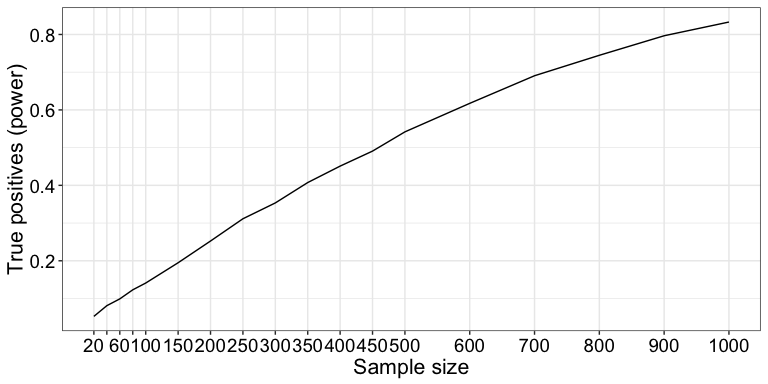

``` r
p.curve <- apply(diff.sig, 2, mean)
```

**Power** Given that there is a population difference of 10%, for 50% of true positives, we need at least 459 observations in each group.

For 70% of true positives, we need at least 717 observations in each group.

Illustrate results: sampling distributions of differences.

``` r
df <- tibble(x = as.vector(diff.dist),
             n = factor(rep(n.seq, each = nsim)))

ggplot(df, aes(x = x)) + theme_gar +
  geom_line(stat = "density", aes(colour = n)) +
    scale_colour_viridis_d() +
  geom_vline(xintercept = -.1) + 
  guides(colour = guide_legend(override.aes = list(size=3),
         title="Sample size")) +
  labs(x = "Correlation coefficients",
       y = "Density")
```

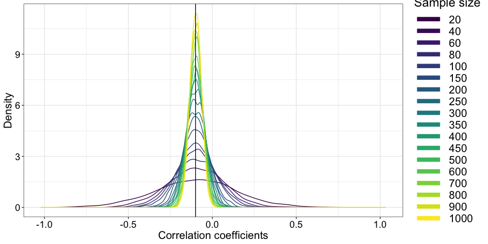

``` r
  # scale_x_continuous(breaks = n.seq)
```

**Precision** What is the proportion of observations within 5% points of the population difference value?

``` r
pop.corr <- -0.1
res.prec <- abs(diff.dist - pop.corr) # absolute differences
res.prop <- apply(res.prec <= 0.05, 2, mean)

# Illustrate proportion of experiments with correlation differences at most 0.05 away from the population difference of -0.1.
df <- tibble(x = n.seq, y = res.prop)

ggplot(df, aes(x = x, y = y)) + theme_gar +
  geom_line() + 
    scale_x_continuous(breaks = n.seq,
                     labels = c("20", " ",  "60", "", "100", as.character(n.seq[6:18]))) +
  theme(panel.grid.minor.x = element_blank()) +
  labs(x = "Sample size", y = "% within 5% points of pop.")
```

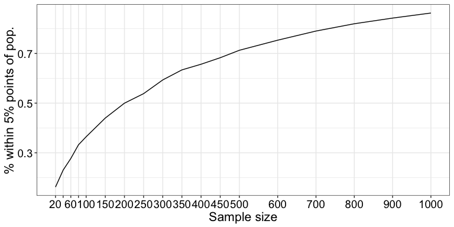

For 50% of estimates to be within +/- 0.05 of the true correlation value, we need at least 200 observations in each group.

For 70% of estimates to be within +/- 0.05 of the true correlation value, we need at least 479 observations in each group.

Dependent case
--------------

### Overlapping case

For instance, if we have 3 dependent variables, we could compare the correlation between variables 1 and 3 to the correlation between variables 2 and 3.

**Generate data**

``` r
set.seed(21)
n <- 50 # sample size
mu <- c(0, 0, 0) # means of the variables
rho12 <- 0.8 # correlation between variables 1 and 2
rho13 <- 0.2 # correlation between variables 1 and 3
rho23 <- 0.6 # correlation between variables 2 and 3
# define covariance matrix
sigma <- matrix(c(1, rho12, rho13, 
                  rho12, 1, rho23,
                  rho13, rho23, 1), 
                nrow = 3, byrow = TRUE) 

data <- MASS::mvrnorm(n = n, mu = mu, Sigma = sigma)
x <- data[,1:2]
y <- data[,3]
```

**Illustrate A-C correlation**

``` r
# make data frame
df <- tibble(x = x[,1],
             y = y)
# ggplot figure
ggplot(df, aes(x = x, y = y)) + theme_classic() +
  geom_point(alpha = 0.6, size = 3) +
  # add smooth regression trend?
  # geom_smooth(method='loess',formula=y~x) +
  theme(axis.title = element_text(size = 15, colour = "black"),
        axis.text = element_text(size = 13, colour = "black"),
        strip.text = element_text(size = 15, face = "bold")) +
  # scale_x_continuous(limits = c(-4, 4),
  #                    breaks = seq(-4, 4, 1)) +
  labs(x = expression(italic("Variable A")), y = expression(italic("Variable C")))
```

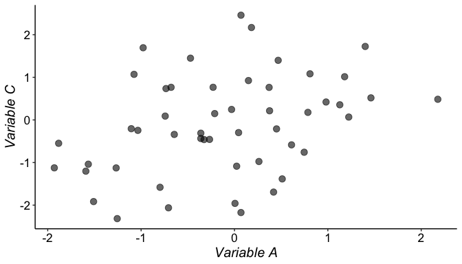

**Illustrate B-C correlation**

``` r
 # make data frame
df <- tibble(x = x[,2],
             y = y)
# ggplot figure
ggplot(df, aes(x = x, y = y)) + theme_classic() +
  geom_point(alpha = 0.6, size = 3) +
  # add smooth regression trend?
  # geom_smooth(method='loess',formula=y~x) +
  theme(axis.title = element_text(size = 15, colour = "black"),
        axis.text = element_text(size = 13, colour = "black"),
        strip.text = element_text(size = 15, face = "bold")) +
  # scale_x_continuous(limits = c(-4, 4),
  #                    breaks = seq(-4, 4, 1)) +
  labs(x = expression(italic("Variable B")), y = expression(italic("Variable C")))
```

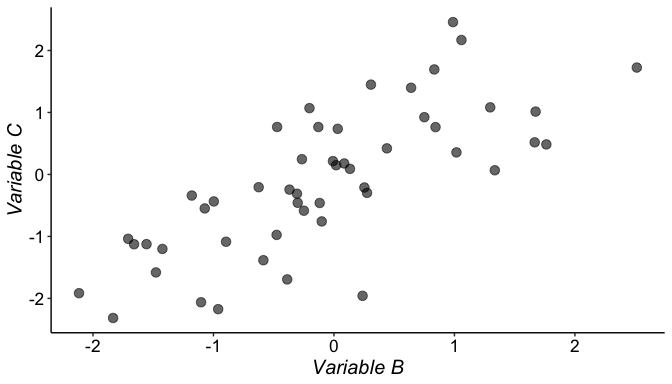

Code from Rand Wilcox:

For Pearson correlation:

``` r
# x = matrix with 2 columns
# y = vector
TWOpov(x,y)
```

    ## $est.rho1
    ## [1] 0.349879
    ## 
    ## $est.rho2
    ## [1] 0.7459425
    ## 
    ## $ci
    ##   ci.lower   ci.upper 
    ## -0.5358359 -0.2562911

``` r
#TWOpovPV to get a p-value
```

For a robust correlation:

``` r
# x = matrix with 2 columns
# y = vector
twoDcorR(x,y, corfun=wincor, SEED=FALSE)
```

    ## $est.rho1
    ## [1] 0.3115092
    ## 
    ## $est.rho2
    ## [1] 0.7897376
    ## 
    ## $est.dif
    ## [1] -0.4782284
    ## 
    ## $ci
    ## [1] -0.7070912 -0.2483081
    ## 
    ## $p.value
    ## [1] 0

### Non-overlapping case

For instance, if we have 4 dependent variables, we could compare the correlation between variables 1 and 2 to the correlation between variables 3 and 4.

For Pearson correlation:

``` r
# x = matrix with 2 columns
# y = matrix with 2 columns
TWOpNOV(x,y)
```

For a robust correlation:

``` r
# x = matrix with 2 columns
# y = matrix with 2 columns
twoDNOV(x,y, corfun=wincor, SEED=FALSE)
```
