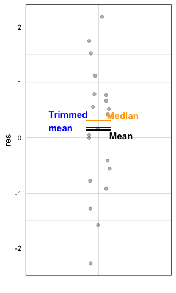
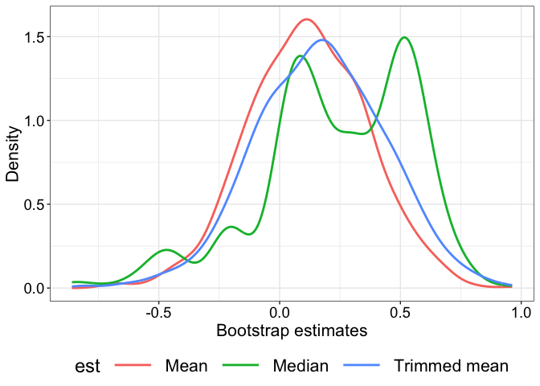
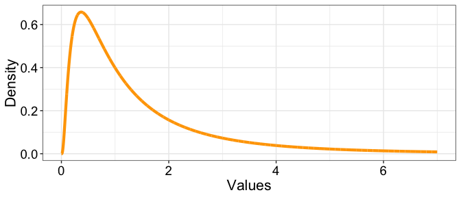
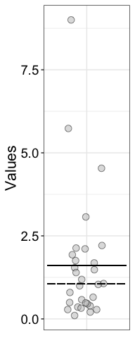
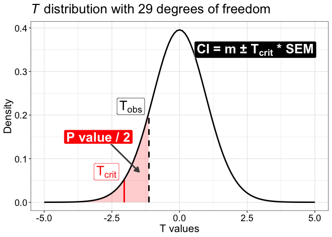
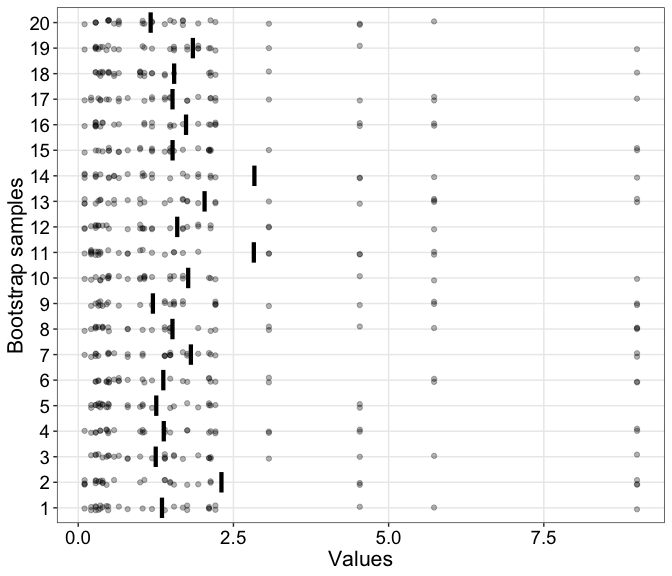
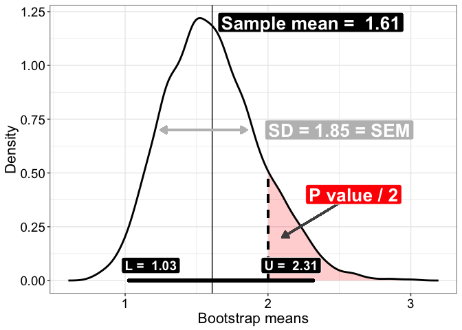

Percentile bootstrap
================
Guillaume A. Rousselet
2019-05-25

Dependencies
============

``` r
library(tibble)
library(ggplot2)
# library(cowplot)
# library(HDInterval)
source("./functions/theme_gar.txt")
```

``` r
sessionInfo()
```

    ## R version 3.5.2 (2018-12-20)
    ## Platform: x86_64-apple-darwin15.6.0 (64-bit)
    ## Running under: macOS Mojave 10.14.5
    ## 
    ## Matrix products: default
    ## BLAS: /Library/Frameworks/R.framework/Versions/3.5/Resources/lib/libRblas.0.dylib
    ## LAPACK: /Library/Frameworks/R.framework/Versions/3.5/Resources/lib/libRlapack.dylib
    ## 
    ## locale:
    ## [1] en_GB.UTF-8/en_GB.UTF-8/en_GB.UTF-8/C/en_GB.UTF-8/en_GB.UTF-8
    ## 
    ## attached base packages:
    ## [1] stats     graphics  grDevices utils     datasets  methods   base     
    ## 
    ## other attached packages:
    ## [1] ggplot2_3.1.1 tibble_2.1.1 
    ## 
    ## loaded via a namespace (and not attached):
    ##  [1] Rcpp_1.0.1       knitr_1.21       magrittr_1.5     tidyselect_0.2.5
    ##  [5] munsell_0.5.0    colorspace_1.4-1 R6_2.4.0         rlang_0.3.4     
    ##  [9] stringr_1.4.0    plyr_1.8.4       dplyr_0.8.0.1    tools_3.5.2     
    ## [13] grid_3.5.2       gtable_0.3.0     xfun_0.4         withr_2.1.2     
    ## [17] htmltools_0.3.6  yaml_2.2.0       lazyeval_0.2.2   digest_0.6.18   
    ## [21] assertthat_0.2.1 crayon_1.3.4     purrr_0.3.2      glue_1.3.1      
    ## [25] evaluate_0.12    rmarkdown_1.11   stringi_1.4.3    compiler_3.5.2  
    ## [29] pillar_1.3.1     scales_1.0.0     pkgconfig_2.0.2

Bootstrap implementation
========================

Let's look at how the bootstrap is implemented in the one-sample case. See an interactive demo [here](https://seeing-theory.brown.edu/frequentist-inference/index.html#section2).

Sampling with replacement
-------------------------

Test the `sample()` function. Let say our sample is a sequence of integers. We sample with replacement from that sequence of numbers. Execute chunk several times to see what happens.

``` r
n <- 10 # sample size
samp <- 1:n
boot.samp <- sample(samp, n, replace = TRUE) # sample with replacement
boot.samp
```

    ##  [1]  9  9  8 10  4  5  5  7  1  1

Generate 3 bootstrap samples for the article:

``` r
set.seed(21) # reproducible example
n <- 6
samp <- 1:n
nboot <- 3
matrix(sample(samp, n*nboot, replace = TRUE), nrow = nboot)
```

    ##      [,1] [,2] [,3] [,4] [,5] [,6]
    ## [1,]    5    2    1    6    1    1
    ## [2,]    2    6    2    5    4    4
    ## [3,]    5    6    6    6    2    2

Loop
----

``` r
set.seed(21) # reproducible results
n <- 20 # sample size
samp <- rnorm(n) # get normal sample
nboot <- 1000 # number of bootstrap samples

# declare vector of results
boot.m <- vector(mode = "numeric", length = nboot) # save means
boot.tm <- vector(mode = "numeric", length = nboot) # save trimmed means
boot.md <- vector(mode = "numeric", length = nboot) # save medians

for(B in 1:nboot){
  boot.samp <- sample(samp, n, replace = TRUE) # sample with replacement
  boot.m[B] <- mean(boot.samp)
  boot.tm[B] <- mean(boot.samp, trim = 0.2)
  boot.md[B] <- median(boot.samp)
}

samp.m <- mean(samp)
samp.tm <- mean(samp, trim = 0.2)
samp.md <- median(samp)
samp.m
```

    ## [1] 0.1363416

``` r
samp.tm
```

    ## [1] 0.1835497

``` r
samp.md
```

    ## [1] 0.3028401

### Plot original results

``` r
set.seed(1)
df <- tibble(cond = factor(rep(1,n)),
             res = samp) 
ggplot(df, aes(x = cond, y = res)) + theme_linedraw() + 
  geom_jitter(width = 0.1, alpha = 0.3) +
  theme(axis.text.x = element_blank(),
    axis.ticks = element_blank()) +
  scale_x_discrete(name ="") +
  # stat_summary(fun.y=median, geom="line")
  geom_segment(aes(x = 0.9, y = samp.m, xend = 1.1, yend = samp.m)) +
  geom_segment(aes(x = 0.9, y = samp.md, xend = 1.1, yend = samp.md), colour = "orange") +
  annotate("text", x = 1.2, y = samp.m, label = "Mean", size = 3) +
  annotate("text", x = 1.2, y = samp.md, label = "Median", size = 3, colour = "orange")
```



### Plot distributions of bootstrap estimates

The distribution of bootstrap medians is multi-modal and very different from that of the mean and the 20% trimmed mean. To compute confidence intervals for the median in the one-sample case, it is recommended to use the parametric approach implemented in the function `sint()`.

``` r
df <- tibble(res = c(boot.m, boot.tm, boot.md),
             est = factor(c(rep("Mean",nboot), rep("Trimmed mean",nboot), rep("Median",nboot)))
             )
ggplot(df, aes(x = res, colour = est)) + theme_gar +
  geom_line(aes(y = ..density..), stat = "density", size = 1) +
  labs(x = "Bootstrap estimates", y = "Density") + 
  theme(legend.position = "bottom")
```



``` r
  # ggtitle("Boostrap samples")
```

Matrix
------

``` r
set.seed(21) # reproducible results
n <- 20 # sample size
samp <- rnorm(n) # get normal sample
nboot <- 1000 # number of bootstrap samples
# sample with replacement + reoganise into a matrix
boot.samp <- matrix(sample(samp, n*nboot, replace = TRUE), nrow = nboot)
boot.m <- apply(boot.samp, 1, mean)
boot.md <- apply(boot.samp, 1, median)
```

Functions
---------

Examples of R packages for bootstrap inferences: - [`boot`](https://www.statmethods.net/advstats/bootstrapping.html) - [`resample`](https://cran.r-project.org/web/packages/resample/index.html) - [`bootstrap`](https://cran.r-project.org/web/packages/bootstrap/index.html) - [`WRS2`](https://cran.r-project.org/web/packages/WRS2/index.html)

Functions from [Rand Wilcox](https://dornsife.usc.edu/labs/rwilcox/software/).

``` r
# TO USE THE FUNCTIONS, FIRST USE THE SOURCE COMMAND:
# source('./functions/Rallfun-v35.txt')

set.seed(1) # reproducible results
onesampb(samp, est=mean, alpha=0.1, nboot=1000, SEED = FALSE, nv = 0)
# est  = estimator, could be var, mad, to use a trimmed mean, add argument trim = 0.2
onesampb(samp, est=mean, alpha=0.1, nboot=1000, SEED = FALSE, nv = 0, trim = 0.1)
# nv = null value for NHST
# always set SEED to FALSE otherwise the function always returns the same results for a given input.
# the only way to really understand the code is to look at it: edit(onesampb)

# for inferences on trimmed means only:
trimpb()

# for inferences on the Harrell-Davis quantile estimator (default q=0.5 = median):
hdpb()
```

Generate sample from lognormal distribution
===========================================

Illustrate population
---------------------

Lognormal distribution from the which the sample is taken.

``` r
x <- seq(0, 7, 0.001)
y <- dlnorm(x)

df <- tibble(x = x, y = y) 

p <- ggplot(df, aes(x = x, y = y)) + theme_gar +
  geom_line(size = 1.5, colour = "orange") +
  labs(x = "Values", y = "Density")
p
```



Get sample
----------

``` r
set.seed(21) # reproducible example
n <- 30 # sample size
meanlog <- 0
sdlog <- 1
samp <- rlnorm(n, meanlog = meanlog, sdlog = sdlog) # random sample
```

Illustrate sample
-----------------

``` r
set.seed(21) # for reproducible jitter
# raw data
df <- tibble(pc = samp,
             cond = rep(1, n))

p <- ggplot(data = df, aes(x = cond, y = pc)) + theme_gar +
  # scatterplots
    geom_jitter(width = .05, alpha = 0.5, 
                size = 3, shape = 21, fill = "grey", colour = "black") +
  theme(axis.ticks.x = element_blank(),
        axis.text.x = element_blank(),
        axis.title.x = element_blank()) +
  scale_x_continuous(breaks = 1) +
  # mean
  geom_segment(aes(x = 0.9, xend = 1.1,
                   y = mean(samp), yend = mean(samp))) +
  # median
  geom_segment(aes(x = 0.9, xend = 1.1,
                   y = median(samp), yend = median(samp)),
               linetype = 'longdash', lineend = 'round') +
  # 20% trimmed mean
  # geom_segment(aes(x = 0.9, xend = 1.1,
  #                  y = mean(samp, trim = 0.2), yend = mean(samp, trim = 0.2)),
  #              linetype = 'dotted', lineend = 'round') +
  theme(panel.grid.minor.x = element_blank()) +
  labs(y = "Values")
  # ggtitle("Random sample") +
  # coord_fixed(ratio = 0.1)
p
```



``` r
pA <- p
```

Standard confidence interval
============================

T-value: define function
------------------------

``` r
# mean minus null value divided by SEM
tval <- function(x,nv){
  tval <- (mean(x) - nv) / sqrt(var(x)/length(x))
  tval
}
```

P value
-------

Let say our hypothesis is mu = 2.

First, let's use the function:

``` r
mu <- 2 # null hypothesis
t.test(samp, mu = mu)$p.value
```

    ## [1] 0.2667699

Then check the formula:

``` r
dof <- length(samp)-1 # degrees of freedom
2 * pt(abs(tval(samp, mu)), dof, lower.tail = FALSE)
```

    ## [1] 0.2667699

Illustrate theoretical *T* distribution
---------------------------------------

``` r
alpha <- 0.05

p <- ggplot(data.frame(x = c(-5, 5)), aes(x)) + theme_gar +
  labs(y = "Density") +
  theme(axis.text = element_text(size = 14),
        axis.title = element_text(size = 16),
        plot.title = element_text(size=20)) +
  labs(x = "T values") +
  ggtitle(substitute(paste(italic(T)," distribution with ",dof," degrees of freedom"), list(dof=dof))) +
  # area under the curve -> p value
  # https://christianburkhart.de/blog/area_under_the_curve/
  stat_function(fun = dt,
                geom = "area",
                xlim = c(-5, tval(samp, mu)),
                alpha = .2,
                fill = "red",
                args = list(df = dof)) +
  # theoretical cut-off t value for alpha = 0.05
  geom_segment(x = qt(alpha/2, dof),
               xend = qt(alpha/2, dof),
               y = 0,
               yend = dt(qt(alpha/2, dof), dof),
               size = 1,
               colour = "red") +
    annotate(geom = "label", x = -2.7, y = 0.07, size  = 7, colour = "red",
             label = expression(paste("T"[crit]))) + # italic("t")
  # observed t value
  # geom_vline(xintercept = abs(tval(samp, mu)))
  geom_segment(x = tval(samp, mu),
               xend = tval(samp, mu),
               y = 0,
               yend = dt(tval(samp, mu), dof),
               size = 1,
               colour = "black",
               linetype = "dashed") +
    annotate(geom = "label", x = -1.8, y = 0.22, size  = 7, colour = "black",
             label = expression(paste("T"[obs]))) + # paste("obs.", italic("t")))
  # Plot density function
  stat_function(fun = dt, args = list(df = dof),
                size = 1) +
  # P value
  geom_segment(x = -2.8, xend = -1.5,
               y = 0.15, yend = 0.07,
               arrow = arrow(type = "closed", 
                             length = unit(0.25, "cm")),
               colour = "grey30",
               size = 1) +
  annotate(geom = "label", x = -3, y = 0.15, size  = 7, 
             colour = "white", fill = "red", fontface = "bold",
             label = "P value / 2") +
  annotate(geom = "label", x = 2.8, y = 0.35, size = 7,
             colour = "white", fill = "black", fontface = "bold",
             label = expression(paste(bold("CI = m \u00B1 T"[crit]),
                                      bold(" * SEM"))))
# ggsave(filename = './theor_t.pdf')
pB <- p
p
```



Compute confidence interval
---------------------------

### Using built-in function

``` r
ci.t <- t.test(samp, mu = mu)$conf.int
ci.t
```

    ## [1] 0.9037929 2.3149338
    ## attr(,"conf.level")
    ## [1] 0.95

### Formula

``` r
alpha <- 0.05 # alpha level
df <- n-1 # degrees of freedom
samp.m <- mean(samp) # sample mean
sem <- sd(samp) / sqrt(n) # sample estimate of the standard error of the mean
ci <- vector("numeric",2)
ci[1] <- samp.m - qt(1-alpha/2, df) * sem # lower bound of CI
ci[2] <- samp.m + qt(1-alpha/2, df) * sem # upper bound of CI
ci
```

    ## [1] 0.9037929 2.3149338

Generate bootstrap samples
==========================

``` r
set.seed(666)
nboot <- 5000
bootsamp <- matrix(sample(samp, nboot * n, replace = TRUE), nrow = nboot)
```

Illustrate a few bootstrap samples
----------------------------------

For each sample we superimpose the (bootstrap) median.

``` r
nb <- 20
df <- tibble(res = as.vector(bootsamp[1:nb,]),
             bootid = rep(1:nb, each = n))

df2 <- tibble(bootid = 1:nb,
              res = apply(bootsamp[1:nb,],1,mean))

p <- ggplot(df, aes(y = bootid, x = res)) + theme_gar +
  geom_point(alpha = 0.3, position = position_jitter(height=0.1)) +
  labs(x = "Values", y = "Bootstrap samples") +
  geom_segment(data = df2, aes(x = res, xend = res,
                               y = bootid - 0.4, yend = bootid + 0.4),
               size = 1.5) +
  theme(panel.grid.minor = element_blank()) +
  scale_y_continuous(breaks = seq(1, 20, 1), expand = expand_scale(mult = c(0.01, 0.01)))
pC <- p
p
```



Illustrate bootstrap sampling distribution of the mean
------------------------------------------------------

Compute confidence interval and other quantities.

Here and in the rest of the tutorial, we compute bootstrap CI using `quantile(type = 6)` of the bootstrap distribution. This is recommended in this article:

Hesterberg, Tim C. “What Teachers Should Know About the Bootstrap: Resampling in the Undergraduate Statistics Curriculum.” The American Statistician 69, no. 4 (October 2, 2015): 371–86. <https://doi.org/10.1080/00031305.2015.1089789>.

Rand Wilcox uses a different approach. See for instance `help(onesampb)`, in which the bounds of the CI are defined using the bootstrap distribution `bvec`, `alpha` (say = 0.05) and `nboot` (say = 1,000 bootstrap samples):

`low <- round((alpha/2)*nboot)` `up <- nboot-low` `low <- low+1` `ci_lower_bound <- bvec[low]` `ci_upper_bound <- bvec[up]`

In practice it is unclear if these choices make any difference. What we know if that with `nboot` large enough, the choice of quantile method should make virtually no difference.

``` r
# bootstrap means
bootm <- apply(bootsamp, 1, mean)
# confidence interval
bootci <- quantile(bootm, probs = c(0.025, 0.975), type = 6)
# bootstrap estimation of the standard error
bootsamp.sd <- sd(bootsamp)
# P value
pv <- mean(bootm < mu) # + .5*mean(bootsamp==mu)
pv <- 2 * min(c(pv, 1-pv))
```

Alternatively, we could compute a highest density interval (HDI)

``` r
require(HDInterval)
boothdi <- HDInterval::hdi(bootm)
```

We illustrate the distribution of the bootstrap samples, from which we derive four elements: - confidence/compatibility interval - p value - bootstrap estimate of the standard error (SE) - bootstrap estimate of bias The distribution is also our best estimate of the shape the sampling distribution of the median, given the data and our model.

Make data frame

``` r
df <- as_tibble(with(density(bootm),data.frame(x,y)))

df.pv <- tibble(x = df$x[df$x>mu],
                y = df$y[df$x>mu])
```

Figure

``` r
p <- ggplot(df, aes(x = x, y = y)) + theme_gar +
      # geom_line(stat = "density") +
  labs(x = "Bootstrap means",
       y = "Density") +
  # P value
  geom_area(data = df.pv,
            aes(x = x, y = y),
            fill = "red", alpha = .2) +
  # density
  geom_line(data = df, size = 1) +
  # Null value
  geom_segment(x = mu,
               xend = mu,
               y = 0,
               yend = df$y[which.min(abs(df$x-mu))],
               size = 1,
               colour = "black",
               linetype = "dashed") +
  # confidence interval ----------------------
  geom_segment(x = bootci[1], xend = bootci[2],
               y = 0, yend = 0,
               lineend = "round", size = 2, colour = "black") +
  annotate(geom = "label", x = bootci[1]+0.15, y = 0.07, size = 5,
             colour = "white", fill = "black", fontface = "bold",
             label = paste("L = ", round(bootci[1], digits = 2))) +
  annotate(geom = "label", x = bootci[2]-0.15, y = 0.07, size = 5,
             colour = "white", fill = "black", fontface = "bold",
             label = paste("U = ", round(bootci[2], digits = 2))) +
  # sample mean: vertical line + label
  geom_vline(xintercept = mean(samp),
             linetype = 'solid') +
  annotate(geom = "label", x = 2.3, y = 1.2, size = 7,
             colour = "white", fill = "black", fontface = "bold",
             label = paste("Sample mean = ", round(samp.m, digits = 2))) +
  # vertical line marking bootstrap mean
  # geom_vline(xintercept = mean(bootsamp),
  #            linetype = 'solid')
  # SEM label + segment
  annotate(geom = "label", x = 2.5, y = 0.7, size  = 7, 
             colour = "white", fill = "grey", fontface = "bold",
             label = paste("SD =",round(bootsamp.sd, digits = 2),"= SEM")) + 
  geom_segment(x = 1.25, 
               xend = 1.85,
               y = 0.7, yend = 0.7,
               arrow = arrow(type = "closed", 
                             length = unit(0.25, "cm"),
                             ends = "both"),
               colour = "grey", size = 1) +
  # P value
  geom_segment(x = 2.6, xend = 2.1, y = 0.4, yend = 0.2,
               arrow = arrow(type = "closed", 
                             length = unit(0.25, "cm")),
               colour = "grey30", size = 1) +
  annotate(geom = "label", x = 2.6, y = 0.4, size  = 7, 
             colour = "white", fill = "red", fontface = "bold",
             label = "P value / 2")
  
p
```



``` r
pD <- p
```

Summary figure
==============

``` r
p1 <- cowplot::plot_grid(pA, pB,
                    labels = c("A", "B"),
                    ncol = 2,
                    nrow = 1,
                    rel_widths = c(1, 4), 
                    label_size = 20, 
                    hjust = -0.5, 
                    scale=.95,
                    align = "h")

p2 <- cowplot::plot_grid(pC, pD,
                    labels = c("C", "D"),
                    ncol = 2,
                    nrow = 1,
                    rel_widths = c(2, 3), 
                    label_size = 20, 
                    hjust = -0.5, 
                    scale=.95,
                    align = "h")

cowplot::plot_grid(p1, p2,
                    labels = c("", ""),
                    ncol = 1,
                    nrow = 2,
                    rel_heights = c(1, 1), 
                    label_size = 20, 
                    hjust = -0.5, 
                    scale=.95,
                    align = "h")

# save figure
ggsave(filename=('./figures/figure_pb.pdf'),width=15,height=15)
```
